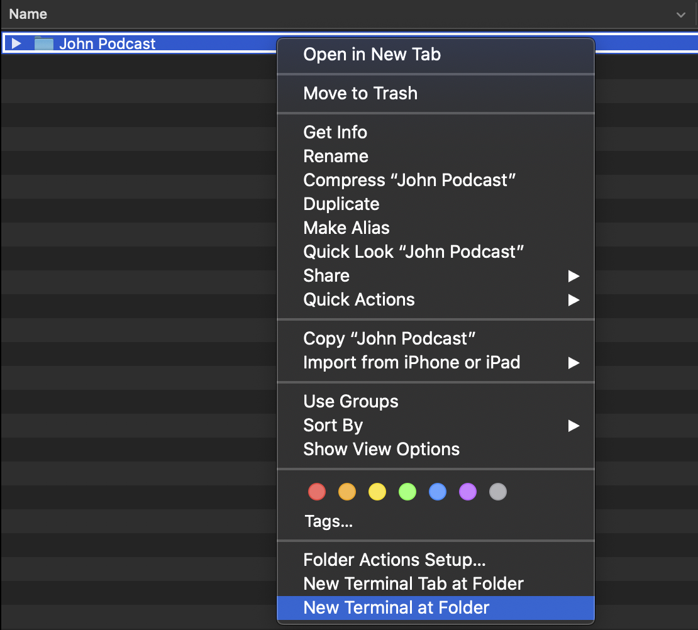

# New Podcast Editing Workflow

This Bash file is designed to create new directories and copy the adequate data for streamlining workflows for podcast editing. 

*Note: This script was designed to run on MacOS and may not work correctly on other operating systems.*

# How To Use

## Installation

Simply place the `create_new.command` file inside of the directory as such:

```
John Podcast
    ├── Project Files
    │   └── John Podcast Episode
    │       └── John Podcast Episode.sesx
    ├── Raw Material
    └── create_new.command
```

## Execution

Executing the script is very simple. Once it is in the correct directory, it just needs to be double clicked. It will open a new terminal window and prompt the user for an episode number input. 

*Note: This script is general purpose. As long as the file structure is the exact same as above (with 'John' being replaced as needed), it will work.*

### Privelages Error

If the file does not have privellages to run, the file will need to be set as executable. This can be done with the following steps.

1. In Finder, find the podcast folder (in this case 'John Podcast'), right click and click "New Terminal at Folder".

2. Type in the following command and press enter after. It will look like nothing happened. 
```
chmod +x create_new.command
```
3. Close terminal and go back to Finder. Now try to open the create_new.command file. It should now work. c

## Result

The resulting directory structure after execution will be as follows:

```
# user is asked for input and provides '10'
John Podcast
    ├── Project Files
    │   ├── John Podcast Episode
    │   │   └── John Podcast Episode.sesx
    │   └── John Podcast Episode 10
    │       └── John Podcast Episode 10.sesx
    ├── Raw Material
    │   └── Episode 10
    └── create_new.command
```